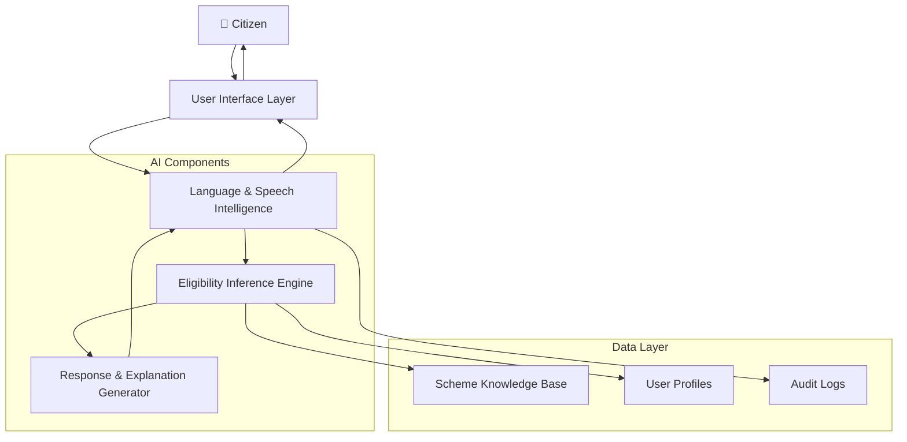
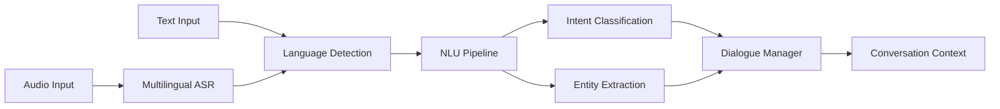
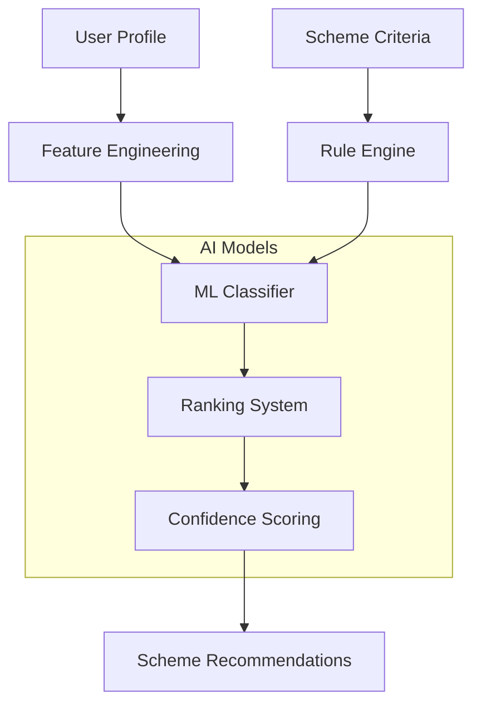
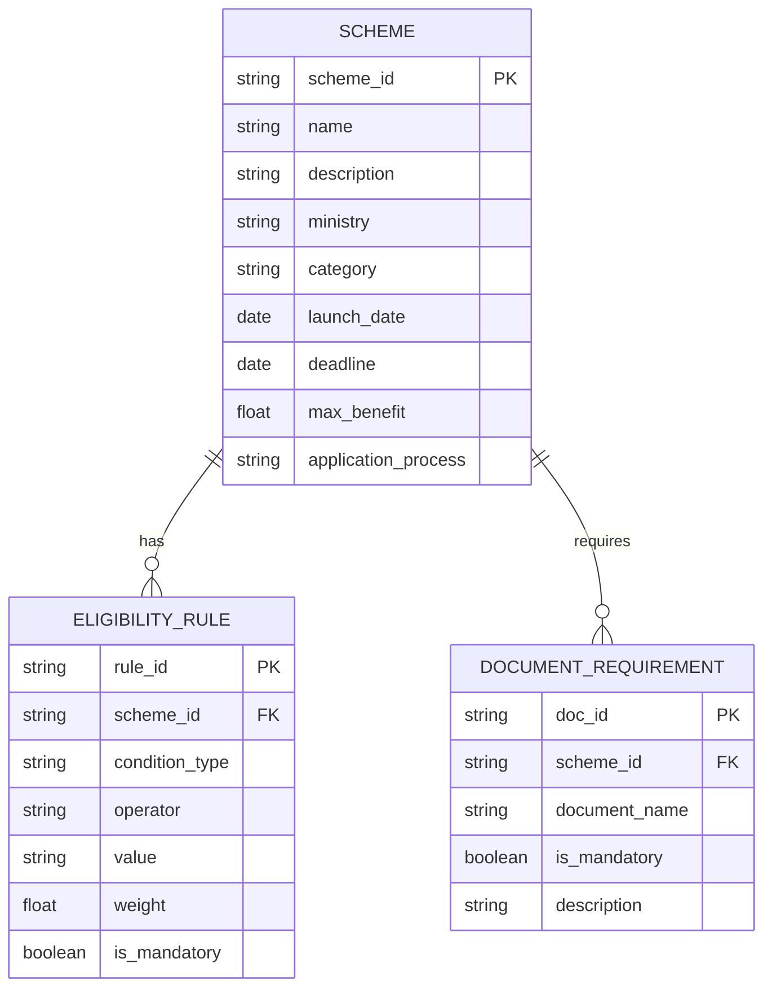
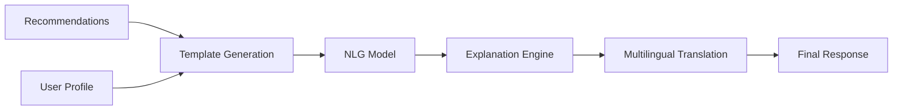
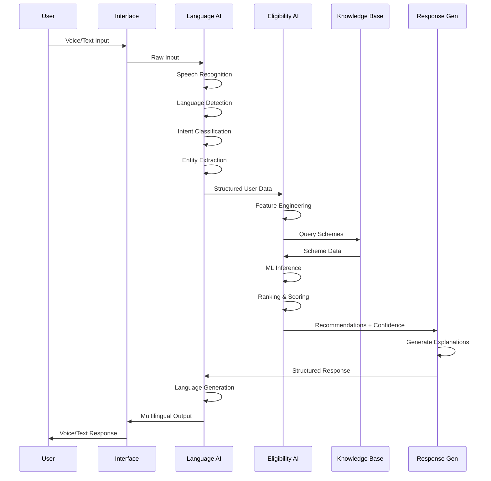

# Design Document

## System Overview

YojnaSetu is a multilingual, AI-powered platform that bridges the gap between citizens and government schemes through intelligent conversation. The system combines speech processing, natural language understanding, and knowledge inference to provide personalized scheme recommendations in real-time.

The architecture follows a microservices pattern with distinct AI components for language processing, eligibility inference, and response generation. Each component is designed to handle the complexity of Indian languages, diverse user backgrounds, and nuanced government scheme eligibility criteria.

## High-Level Architecture

The system operates as a conversational AI pipeline where each component adds intelligence:
- **User Interface Layer**: Handles voice/text input and output
- **Language & Speech Intelligence**: Processes multilingual input and manages conversation flow
- **Eligibility Inference Engine**: Core AI that matches users to schemes
- **Scheme Knowledge Base**: Structured repository of government schemes
- **Response & Explanation Generator**: Creates personalized, explainable recommendations

## Component Breakdown

### User Interface Layer

**Purpose**: Provide accessible, voice-first interaction for diverse user demographics.

**Components**:
- **Voice Interface**: Speech-to-text and text-to-speech processing
- **Text Interface**: Fallback for users with hearing impairments
- **Session Manager**: Maintains conversation state and user context
- **Input Validator**: Ensures data quality and handles edge cases

**Technology Stack**:
- Web-based interface with WebRTC for real-time audio
- Progressive Web App (PWA) for mobile accessibility
- WebSpeech API with fallback to cloud speech services
- Responsive design for various device types

**Key Features**:
- Hands-free operation with voice commands
- Visual feedback for speech recognition status
- Adjustable speech rate and volume
- Offline capability for basic interactions

### Language & Speech Intelligence

**Purpose**: Bridge language barriers and manage natural conversation flow.

**AI Components**:
- **Multilingual ASR**: Automatic Speech Recognition for Indian languages
- **Language Detection**: Identify user's preferred language
- **Intent Classification**: Understand user goals and requests
- **Entity Extraction**: Extract demographic and contextual information
- **Dialogue Manager**: Maintain conversation state and flow

**Model Architecture**:

**Language Support Strategy**:
- **Primary**: Hindi, English (high-resource languages)
- **Secondary**: Tamil, Telugu, Bengali (medium-resource languages)
- **Approach**: Transfer learning from multilingual models (mBERT, XLM-R)
- **Fallback**: English translation for unsupported languages

**Conversation Management**:
- State-based dialogue tracking
- Context-aware question generation
- Clarification handling for ambiguous inputs
- Graceful error recovery with voice guidance

### Eligibility Inference Engine

**Purpose**: Core AI system that intelligently matches users to applicable government schemes.

**AI Architecture**:

**Core Components**:

1. **Feature Engineering**:
   - Demographic encoding (age, gender, location, occupation)
   - Socioeconomic indicators (income, family size, assets)
   - Contextual features (urgency, preferences, history)
   - Missing data imputation using statistical methods

2. **Rule Engine**:
   - Hard eligibility constraints (age limits, income thresholds)
   - Logical rule evaluation with uncertainty handling
   - Exception handling for special cases
   - Regulatory compliance validation

3. **ML Classifier**:
   - Multi-label classification for scheme applicability
   - Gradient boosting model (XGBoost/LightGBM) for structured data
   - Neural network for complex feature interactions
   - Ensemble methods for improved accuracy

4. **Ranking System**:
   - Benefit amount estimation
   - Application difficulty scoring
   - Deadline urgency weighting
   - User preference alignment

5. **Confidence Scoring**:
   - Uncertainty quantification for recommendations
   - Calibrated probability outputs
   - Explanation of confidence factors
   - Threshold-based filtering

**Why AI is Essential Here**:
- **Complex Interactions**: Government schemes have intricate eligibility rules with multiple conditions, exceptions, and edge cases that simple rule-based systems cannot handle effectively.
- **Incomplete Information**: Users often provide partial information; AI can infer missing details and handle uncertainty gracefully.
- **Personalization**: AI enables dynamic ranking based on individual circumstances rather than static rule matching.
- **Continuous Learning**: The system can improve recommendations based on user feedback and application outcomes.

### Scheme Knowledge Base

**Purpose**: Structured repository of government schemes with intelligent querying capabilities.

**Data Architecture**:

**Key Features**:
- **Multilingual Content**: Scheme information in all supported languages
- **Structured Eligibility**: Machine-readable eligibility criteria
- **Version Control**: Track scheme updates and changes
- **Search Optimization**: Indexed for fast querying and filtering
- **Validation**: Data quality checks and consistency validation

**Data Sources**:
- Government portals (MyGov, India.gov.in)
- Ministry websites and notifications
- State government scheme databases
- NGO and research organization compilations

### Response & Explanation Generator

**Purpose**: Create personalized, explainable recommendations in user's preferred language.

**AI Components**:
- **Template-Based Generation**: Structured response templates
- **Natural Language Generation**: Dynamic content creation
- **Explanation Engine**: Reasoning transparency
- **Multilingual Output**: Language-specific response formatting

**Generation Pipeline**:

**Explanation Strategy**:
- **Why Eligible**: Clear reasoning for scheme recommendations
- **Why Not Eligible**: Explanation for rejected schemes with improvement suggestions
- **Confidence Indicators**: Transparent uncertainty communication
- **Next Steps**: Actionable guidance for application process

**Language Adaptation**:
- Cultural context awareness
- Appropriate formality levels
- Regional terminology usage
- Audio pronunciation optimization

## AI Workflow (End-to-End Data Flow)

**Detailed Flow Steps**:

1. **Input Processing** (LSI):
   - Convert speech to text using multilingual ASR
   - Detect language and switch processing pipeline
   - Extract intents (information seeking, clarification, application guidance)
   - Identify entities (age, location, income, family details)

2. **Context Building** (LSI + EIE):
   - Merge new information with existing user profile
   - Validate and clean extracted data
   - Identify missing critical information
   - Generate follow-up questions if needed

3. **Scheme Matching** (EIE):
   - Engineer features from user profile
   - Apply hard eligibility rules
   - Run ML models for soft matching
   - Calculate confidence scores

4. **Ranking & Selection** (EIE):
   - Rank schemes by relevance and benefit
   - Apply user preferences and constraints
   - Filter by confidence thresholds
   - Select top N recommendations

5. **Response Generation** (RG):
   - Create explanations for recommendations
   - Generate application guidance
   - Format for target language and modality
   - Include confidence indicators

6. **Output Delivery** (LSI + UI):
   - Convert to target language if needed
   - Generate speech audio
   - Present with appropriate interface elements
   - Log interaction for improvement

## Model Choices & Rationale

### Speech Recognition
**Choice**: Wav2Vec2 + Language-Specific Fine-tuning
**Rationale**: 
- Strong performance on low-resource languages
- Self-supervised pre-training reduces data requirements
- Fine-tunable for Indian accents and languages
- Open-source with commercial viability

**Fallback**: Google Cloud Speech-to-Text API for production reliability

### Natural Language Understanding
**Choice**: Multilingual BERT (mBERT) + Task-Specific Heads
**Rationale**:
- Pre-trained on 104 languages including Indian languages
- Strong transfer learning capabilities
- Proven performance on intent classification and NER
- Reasonable computational requirements

**Architecture**:
- Shared mBERT encoder
- Separate classification heads for intent and entity extraction
- Language-specific fine-tuning layers

### Eligibility Inference
**Choice**: Ensemble of XGBoost + Neural Network
**Rationale**:
- XGBoost excels at structured/tabular data
- Neural networks capture complex feature interactions
- Ensemble reduces overfitting and improves robustness
- Interpretable feature importance from XGBoost

**Features**:
- Demographic features (age, gender, location, occupation)
- Economic indicators (income, assets, family size)
- Contextual features (urgency, preferences, history)
- Scheme-specific features (benefit amount, difficulty, deadline)

### Response Generation
**Choice**: Template-Based + GPT-3.5 for Dynamic Content
**Rationale**:
- Templates ensure consistency and accuracy
- GPT-3.5 adds natural language fluency
- Hybrid approach balances quality and control
- Cost-effective for hackathon prototype

## Responsible AI & Privacy Considerations

### Privacy Protection
**Data Minimization**:
- Collect only necessary information for scheme matching
- Avoid storing sensitive personal identifiers
- Use pseudonymization for user tracking
- Implement data retention policies

**Consent Management**:
- Clear consent for data collection and processing
- Granular permissions for different data types
- Easy opt-out mechanisms
- Transparent data usage explanations

**Security Measures**:
- End-to-end encryption for voice data
- Secure API endpoints with authentication
- Regular security audits and penetration testing
- Compliance with Indian data protection laws

### Fairness & Bias Mitigation
**Bias Detection**:
- Regular audits for demographic bias in recommendations
- Performance monitoring across different user groups
- Fairness metrics for scheme matching accuracy
- Community feedback integration

**Mitigation Strategies**:
- Diverse training data across demographics and regions
- Bias-aware model training techniques
- Human oversight for sensitive decisions
- Transparent explanation of recommendation logic

### Transparency & Explainability
**User-Facing Explanations**:
- Clear reasoning for scheme recommendations
- Confidence indicators for uncertain matches
- Alternative options when primary schemes unavailable
- Plain language explanations avoiding technical jargon

**System Transparency**:
- Open documentation of AI model choices
- Regular accuracy and performance reporting
- Clear escalation paths for disputes
- Community involvement in system improvement

## Scalability & Future Enhancements

### Technical Scalability
**Infrastructure**:
- Microservices architecture for independent scaling
- Container-based deployment (Docker/Kubernetes)
- Cloud-native design with auto-scaling capabilities
- CDN for global content delivery

**Performance Optimization**:
- Model quantization for faster inference
- Caching strategies for frequent queries
- Asynchronous processing for non-critical tasks
- Load balancing across multiple instances

### Functional Enhancements
**Short-term (3-6 months)**:
- Additional Indian languages (Gujarati, Marathi, Punjabi)
- Integration with government application portals
- SMS/WhatsApp interface for broader accessibility
- Offline capability for basic scheme information

**Medium-term (6-12 months)**:
- Predictive analytics for scheme success probability
- Integration with Aadhaar for automatic eligibility verification
- Community features for peer support and guidance
- Advanced personalization based on user behavior

**Long-term (1-2 years)**:
- AI-powered application form filling
- Real-time scheme status tracking
- Integration with banking systems for benefit delivery
- Expansion to other government services beyond schemes

### Data & Model Improvements
**Continuous Learning**:
- User feedback integration for model improvement
- A/B testing for recommendation algorithms
- Regular retraining with new scheme data
- Performance monitoring and drift detection

**Data Expansion**:
- Integration with more government data sources
- Real-time scheme updates and notifications
- Historical success rate tracking
- Regional customization based on local schemes

## Limitations & Risks

### Technical Limitations
**Speech Recognition**:
- Accuracy degradation with background noise
- Challenges with heavy accents or dialects
- Limited performance on very low-resource languages
- Dependency on internet connectivity for cloud models

**AI Model Limitations**:
- Potential bias in training data
- Uncertainty in edge cases and unusual circumstances
- Limited ability to handle completely novel situations
- Dependency on quality of government scheme data

### Operational Risks
**Data Quality**:
- Outdated or incorrect scheme information
- Inconsistencies across different government sources
- Missing or incomplete eligibility criteria
- Delays in scheme updates and notifications

**User Adoption**:
- Digital literacy barriers in target demographics
- Trust issues with AI-powered government services
- Language and cultural barriers not fully addressed
- Competition with existing manual processes

### Mitigation Strategies
**Technical Mitigations**:
- Robust error handling and graceful degradation
- Multiple fallback options for each component
- Regular model validation and performance monitoring
- Human oversight for critical decisions

**Operational Mitigations**:
- Partnership with government agencies for data accuracy
- Community outreach and education programs
- Gradual rollout with pilot programs
- Continuous user feedback collection and integration

**Risk Monitoring**:
- Real-time performance dashboards
- User satisfaction surveys and feedback loops
- Regular security and privacy audits
- Compliance monitoring for regulatory requirements

## Correctness Properties

*A property is a characteristic or behavior that should hold true across all valid executions of a system—essentially, a formal statement about what the system should do. Properties serve as the bridge between human-readable specifications and machine-verifiable correctness guarantees.*

### Property 1: Multilingual Processing Consistency
*For any* supported language input (Hindi, English, Tamil, Telugu, Bengali), the system should correctly detect the language and respond in the same language with appropriate cultural context.
**Validates: Requirements 1.1, 1.3, 1.5**

### Property 2: Speech Recognition Accuracy
*For any* audio input in supported languages, the Voice_Interface should convert speech to text with at least 90% accuracy, handling background noise and accent variations.
**Validates: Requirements 1.2, 1.4**

### Property 3: Information Extraction Completeness
*For any* user conversation describing personal circumstances, the Eligibility_Engine should extract all relevant demographic and socioeconomic indicators (income, age, gender, location, occupation, family composition) that are mentioned or can be reasonably inferred.
**Validates: Requirements 2.1, 2.3**

### Property 4: Conversational Eligibility Assessment
*For any* user profile with sufficient information, the system should determine scheme eligibility without requiring explicit form-filling, using only conversational input.
**Validates: Requirements 2.2**

### Property 5: Incomplete Information Handling
*For any* user profile with missing critical information, the system should identify the gaps and ask appropriate clarifying questions to complete the assessment.
**Validates: Requirements 2.4**

### Property 6: Scheme Ranking Consistency
*For any* set of applicable schemes for a user, the system should rank them by relevance and potential benefit, with higher-benefit schemes prioritized when other factors are equal.
**Validates: Requirements 2.5, 4.1**

### Property 7: Data Completeness and Integrity
*For any* scheme stored in the database, all required fields (name, description, eligibility criteria, benefits, application process, required documents) should be present and complete in all supported languages.
**Validates: Requirements 3.1, 3.5, 4.3, 8.2**

### Property 8: Real-time Data Consistency
*For any* scheme data update or addition, the changes should be immediately reflected in matching results and recommendations without system restart.
**Validates: Requirements 3.2, 3.4**

### Property 9: Complex Rule Processing
*For any* scheme with complex eligibility rules involving multiple conditions and exceptions, the system should correctly evaluate all conditions and handle logical combinations (AND, OR, NOT operations).
**Validates: Requirements 3.3**

### Property 10: Recommendation Explanation Completeness
*For any* scheme recommendation, the system should provide clear explanations referencing specific user profile elements that led to the recommendation.
**Validates: Requirements 4.2**

### Property 11: Application Guidance Completeness
*For any* selected scheme, the system should provide complete application guidance including step-by-step instructions, required documents, contact information, and timeline expectations.
**Validates: Requirements 4.4, 8.1, 8.3, 8.5**

### Property 12: Alternative Suggestion Behavior
*For any* user who is ineligible for popular or requested schemes, the system should suggest relevant alternative schemes that match their profile.
**Validates: Requirements 4.5**

### Property 13: User Profile Management
*For any* user interaction, the system should create, maintain, and update user profiles based on conversation history, allowing users to correct or update their information.
**Validates: Requirements 5.1, 5.3, 5.5**

### Property 14: User Recognition and Context Retrieval
*For any* returning user, the system should recognize them and retrieve their stored context to continue conversations seamlessly.
**Validates: Requirements 5.2**

### Property 15: Voice Confirmation Protocol
*For any* important information or decision point in the conversation, the system should request voice confirmation before proceeding.
**Validates: Requirements 6.3**

### Property 16: Error Recovery Mechanism
*For any* error condition during operation, the system should provide voice-based error messages and offer clear recovery options to continue the interaction.
**Validates: Requirements 6.4**

### Property 17: Voice Command Recognition
*For any* supported voice command for navigation or control, the system should recognize and execute the command appropriately.
**Validates: Requirements 6.5**

### Property 18: Response Time Performance
*For any* user information input, the Eligibility_Engine should process and return results within 3 seconds for simple cases and within 5 seconds for complex eligibility rules.
**Validates: Requirements 7.1, 7.5**

### Property 19: Confidence Score Provision
*For any* scheme recommendation, the system should provide calibrated confidence scores indicating the certainty of the eligibility assessment.
**Validates: Requirements 7.2**

### Property 20: Uncertainty Communication
*For any* eligibility assessment with low confidence or ambiguous criteria, the system should clearly communicate the uncertainty to the user.
**Validates: Requirements 7.3**

### Property 21: Dynamic Recommendation Updates
*For any* user profile that receives additional information during conversation, the system should update recommendations to reflect the new information.
**Validates: Requirements 7.4**

### Property 22: Communication Options Availability
*For any* scheme application guidance, the system should offer to send details via SMS or email as alternative communication channels.
**Validates: Requirements 8.4**

## Error Handling

### Input Validation and Sanitization
- **Audio Input**: Validate audio format, duration, and quality before processing
- **Text Input**: Sanitize text input to prevent injection attacks and handle special characters
- **User Data**: Validate demographic information for consistency and reasonable ranges
- **Scheme Queries**: Validate search parameters and handle malformed requests gracefully

### Graceful Degradation Strategies
- **Speech Recognition Failure**: Fall back to text input with clear user guidance
- **Language Detection Uncertainty**: Default to user's previously detected language or ask for clarification
- **AI Model Unavailability**: Use rule-based fallback systems for basic eligibility checking
- **Database Connectivity Issues**: Serve cached scheme information with appropriate disclaimers

### Error Recovery Mechanisms
- **Conversation State Recovery**: Maintain conversation checkpoints to resume after interruptions
- **Partial Information Handling**: Continue processing with available information and request missing details
- **Timeout Management**: Handle long processing times with progress indicators and user communication
- **Retry Logic**: Implement exponential backoff for transient failures

### User Communication During Errors
- **Clear Error Messages**: Provide non-technical explanations of what went wrong
- **Recovery Guidance**: Offer specific steps users can take to resolve issues
- **Alternative Paths**: Suggest different ways to achieve the same goal when primary methods fail
- **Escalation Options**: Provide contact information for human assistance when needed

## Testing Strategy

### Dual Testing Approach

The testing strategy employs both unit testing and property-based testing to ensure comprehensive coverage:

**Unit Tests**: Verify specific examples, edge cases, and error conditions
- Test specific scheme matching scenarios with known user profiles
- Validate error handling for malformed inputs
- Test integration points between system components
- Verify specific language processing examples

**Property Tests**: Verify universal properties across all inputs
- Test correctness properties with randomly generated user profiles and scheme data
- Validate system behavior across all supported languages
- Test performance requirements under various load conditions
- Verify data consistency across different input combinations

### Property-Based Testing Configuration

**Testing Framework**: Hypothesis (Python) for property-based testing
**Test Configuration**:
- Minimum 100 iterations per property test
- Each property test references its corresponding design document property
- Tag format: **Feature: yojna-setu, Property {number}: {property_text}**

**Test Data Generation**:
- **User Profiles**: Generate diverse demographic combinations (age: 18-100, income: 0-10M, family size: 1-15, locations across India)
- **Audio Samples**: Synthetic speech in supported languages with varying noise levels and accents
- **Scheme Data**: Generate schemes with various eligibility criteria combinations and benefit amounts
- **Conversation Flows**: Generate realistic conversation patterns and user input sequences

**Performance Testing**:
- Load testing with 100+ concurrent users
- Response time validation under various system loads
- Memory usage monitoring during extended conversations
- Database query performance with large scheme datasets

### Integration Testing Strategy

**End-to-End Workflows**:
- Complete user journey from initial contact to scheme recommendation
- Multi-turn conversation handling with context preservation
- Cross-language conversation switching
- Error recovery and graceful degradation scenarios

**Component Integration**:
- Speech recognition to language processing pipeline
- Language processing to eligibility inference integration
- Eligibility engine to knowledge base queries
- Response generation to multilingual output

**External System Integration**:
- Government database connectivity and data synchronization
- SMS/Email service integration for communication
- Authentication and user management systems
- Monitoring and logging infrastructure

### Continuous Testing and Monitoring

**Automated Testing Pipeline**:
- Continuous integration with automated test execution
- Performance regression testing on each deployment
- Property test execution with expanded iteration counts in staging
- Integration test suite execution against production-like environments

**Production Monitoring**:
- Real-time accuracy monitoring for speech recognition and scheme matching
- User satisfaction tracking through feedback collection
- Performance metrics monitoring (response times, error rates, availability)
- A/B testing framework for model improvements and feature rollouts